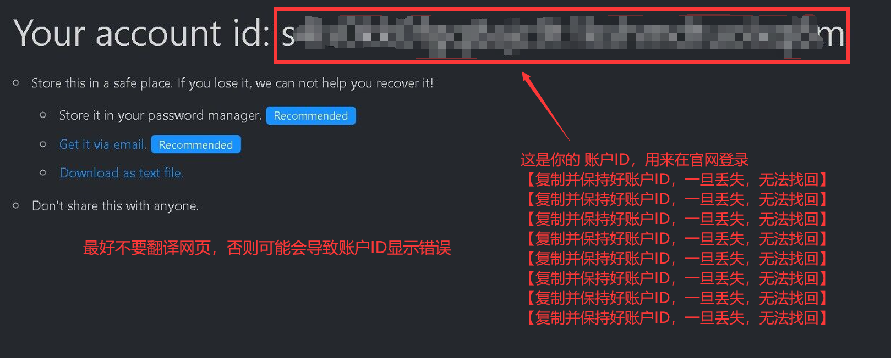
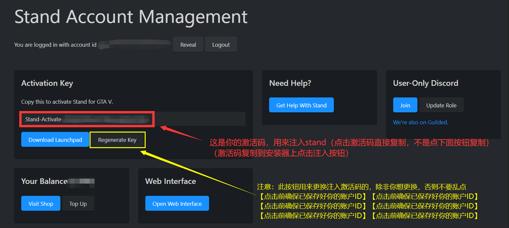
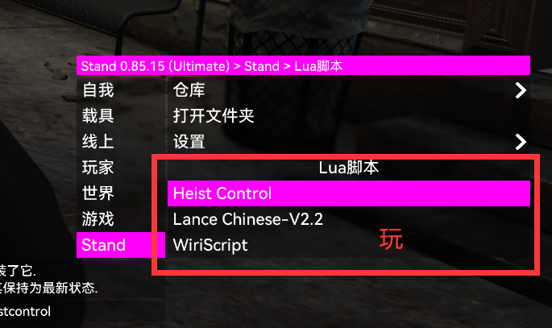

# stand教程

## stand激活

**打开创建地址：**[https://stand.gg/account/register](https://stand.gg/account/register)

如果打不开官网请[修改DNS](xiu-gai-dns.md)或者使用VPN软件

<figure><figcaption></figcaption></figure>

<figure><figcaption></figcaption></figure>

**点击打开登录官网界面：**[https://stand.gg/account/login](https://stand.gg/account/login)

<figure><figcaption></figcaption></figure>

<figure><figcaption></figcaption></figure>

**注意事项：**

这里所说的激活码也可叫做使用码，用来注入stand，无法用于登陆官网，可以给他人使用，不会导致stand账户被封禁。

账户ID是登陆官网用的，无法用于注入stand，自己保存好，一旦丢失就无法找回。

账户ID一旦因以下原因被封禁就无法解除，只能重新购买。

1.禁止分享账户ID，官方有自动检测机制，违规账户ID会被封禁。

2.禁止使用stand在任何战局发送广告，或者短信轰炸其他玩家，否则账户ID会被封禁。

## 注入stand

下载注入器：[https://stand.gg/dl/launchpad/1.8.2/Stand%20Launchpad.exe](https://stand.gg/dl/launchpad/1.8.2/Stand%20Launchpad.exe)​​

<figure><figcaption></figcaption></figure>

未开启游戏打开注入器就是上图所示的样子

<figure><figcaption></figcaption></figure>

打开游戏后就如上图所示，点击Inject stand即可注入

注意：

尽量在线下注入后再进入线上，线上注入可能会出现bug

## stand操作教程

在你第一次使用stand的时候会有操作教学，建议认真的跟着做一遍，因为基本上所有的菜单操作都涵盖在教学里面，以后忘了也可以打开教学重新学习使用。

#### 对于有小键盘的用户

小键盘+号键 呼出/隐藏&#x20;

小键盘8246控制上下左右

小键盘 5确定 0返回 7上翻列表，1下翻列表

#### 对于没有小键盘的用户

F4呼出/隐藏&#x20;

键盘旁边的↑↓←→控制上下左右，回车确定 退格键返回&#x20;

键盘右边的Ctrl下翻列表，右Shift键上翻列表

## Stand lua安装教程

<figure><figcaption>
切换到这里
</figcaption></figure>

<figure><figcaption></figcaption></figure>

框出来的就是已经安装上的脚本，想要获得其他脚本可以进入上图选项最上面的仓库里面勾选

### Stand 无法连接到服务器或连接不稳定

**如果你进入故事模式后是下图中的情况或者玩的时候stand变成这样，说明你网络有问题**

<figure><figcaption></figcaption></figure>

建议使用GoLink加速器或者迅游加速器，挂VPN也可以解决。不过建议先[修改DNS](xiu-gai-dns.md)试试，如果[修改DNS](xiu-gai-dns.md)就能稳定连接了就不用搞这些了。

