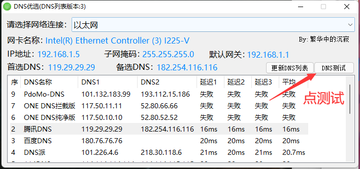
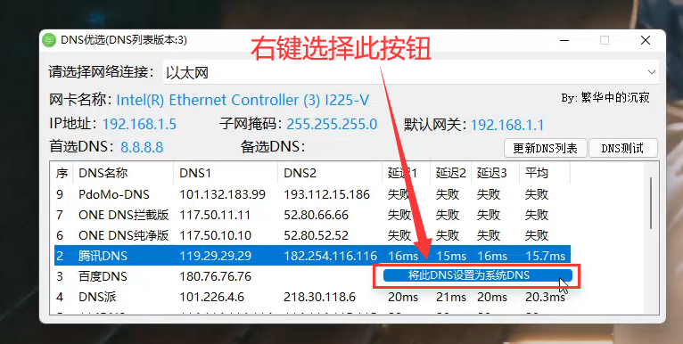

# 修改DNS

**下载：**[https://lanzoux.com/dnsyx](https://lanzoux.com/dnsyx)

<figure><figcaption></figcaption></figure>

<figure><figcaption></figcaption></figure>

<figure><figcaption></figcaption></figure>

<figure><figcaption></figcaption></figure>

完成后DNS就修改成功了，但是这个方法并不一定能解决网络上的问题，使用VPN软件效果更好
